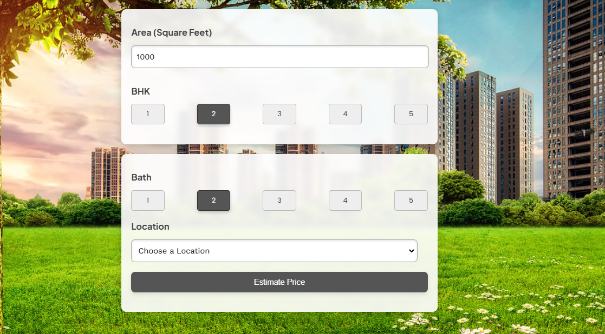

# Bengaluru House Price Prediction

## Project Overview

This project aims to predict house prices in Bengaluru using a **Machine Learning** approach. The model is trained using a dataset of historical house prices in Bengaluru, with multiple features such as area, number of bedrooms, square footage, and more. The project focuses on cleaning, transforming, and processing the data to create a reliable regression model capable of predicting house prices accurately.

The application was built with a **Flask** backend and **HTML/CSS/JavaScript** frontend, integrating the trained machine learning model into a real-world web application.

---

## Key Features

- **Data Preprocessing:** 
  - Data is cleaned and transformed using Pandas, handling missing values and applying feature engineering techniques such as extracting the number of bedrooms and calculating the price per square foot.
  
- **Outlier Removal:**
  - The dataset was analyzed and cleaned by removing erroneous data points based on domain knowledge and statistical methods. Business rules such as ensuring square footage per bedroom remained above a certain threshold were implemented.

- **Regression Model:**
  - A **Linear Regression** model was trained to predict house prices based on the processed features.
  - **GridSearchCV** was used to find the best model among multiple algorithms such as **Linear Regression**, **Lasso**, and **Decision Tree Regressor**.

- **Model Evaluation:**
  - The model was evaluated using **K-Fold Cross Validation**, providing a reliable estimate of its performance with scores above 80%.
  
- **Prediction API:**
  - A prediction function was created to allow users to input parameters such as location, square footage, number of bathrooms, and bedrooms, and receive a price prediction.

---

## Technologies Used

- **Python:** 
  - The machine learning and data preprocessing tasks were performed using Python, utilizing libraries such as:
    - `Pandas` for data manipulation.
    - `NumPy` for numerical operations.
    - `Scikit-learn` for model training, cross-validation, and hyperparameter tuning.

- **Machine Learning Model:**
  - **Linear Regression** was the best performing model for predicting house prices, with accuracy above 80% on average.
  
- **Flask Backend:**
  - The Flask framework was used to create a simple web server to host the model and provide prediction services via an API.
  
- **Frontend:**
  - The frontend was developed using **HTML**, **CSS**, and **JavaScript**, which displays the input forms and the results of predictions in a user-friendly interface.

---

## How the Model Works

1. **Data Preparation:**
   - The dataset is first loaded, and unnecessary columns are removed.
   - Missing data is handled by dropping rows with null values.
   - Features like number of bedrooms (`bhk`) and price per square foot are derived from existing data.

2. **Outlier Handling:**
   - Outliers in the data are detected and removed using business logic and statistical methods. Properties with unusual square footage or price per square foot are removed from the dataset.

3. **Model Training:**
   - A **Linear Regression** model is trained using the cleaned and transformed data. The trained model can then be used to predict the price of a house based on the input features.

4. **Prediction:**
   - The Flask backend allows users to input the location, square footage, number of bedrooms, and bathrooms, and predict the price of the house.

